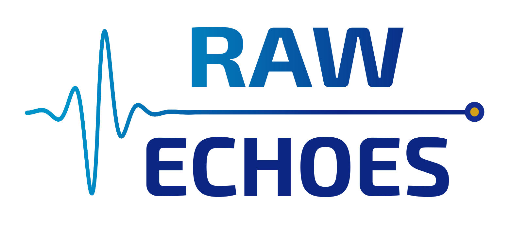

  

# Our Mission

> Making ultrasound acquisition more accessible through open,
> user-friendly systems.

We develop open, research-grade ultrasound acquisition technology, combining
compact, resource-efficient hardware with the software needed to operate it. Our goal is to
build robust, feature-rich instruments that are affordable and practical to reproduce.

Our systems are designed for:

- **Researchers**, with the openness and capabilities needed for experimental work
- **Industrial R&D engineers**, with standard interfaces for transducers and data links
- **Hobbyists and makers**, with extensive documentation and low reproduction costs
- **Students and educators**, with a fully open development flow for learning and teaching

## Our Approach

- The complete development process is open, from initial concepts to finished designs
- Open-source tools wherever possible for PCB design, firmware, and software
- Active community engagement and interdisciplinary collaborations

## Our Designs

Our team has more than 10 years of combined experience developing ultrasound
acquisition platforms, including [TinyProbe](https://github.com/pulp-bio/TinyProbe),
LightABVS,
[WULPUS](https://github.com/pulp-bio/wulpus), and
[WULPUS PRO](https://github.com/pulp-bio/wulpus-pro).

> Our next step is something special and will be announced soon!
